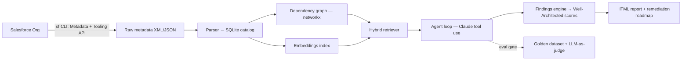

# Trowel — for Salesforce

**AI-powered Well-Architected assessments for Salesforce orgs.** Trowel excavates an org — mapping every Flow, Apex class, field, and permission — and produces the assessment a consultancy would charge $50k for.

*The Salesforce org archaeologist.*

Point it at any org. It tells you what the org *actually does*, where the tech debt is buried, which automations fight each other, and what to fix first.

> Built by [Pakshal Shah](https://linkedin.com/in/pakshalshah30) — Senior Business Analyst & 7x-certified Salesforce specialist — as a working answer to the question: *what does agentic AI look like inside a governed enterprise platform?*
>
> Internal codename: `archaeologist` (you'll see it in the Python module names — the dig-site metaphor runs all the way down).

## What it does

1. **Excavate** — pulls full org metadata via the Salesforce CLI (Metadata + Tooling APIs)
2. **Catalog** — parses everything into a queryable inventory + dependency graph
3. **Understand** — hybrid retrieval (graph traversal + embeddings) lets an LLM agent answer questions like *"what happens when a Lead converts?"*
4. **Assess** — scores the org against Salesforce Well-Architected pillars, flags dead automation, conflicting triggers/Flows, permission sprawl
5. **Report** — generates a prioritized, plain-English remediation roadmap with an HTML report

## Why this is hard (and interesting)

- Org metadata is **structured** — pure vector RAG misses exact references, so retrieval is hybrid: dependency-graph traversal for facts, embeddings for semantics
- Findings must be **trustworthy** — every analysis path is gated by a golden-dataset eval suite (LLM-as-judge + deterministic checks) before it ships
- The agent must **reason across artifacts** — a "dead field" is only dead if no Flow, Apex, report, or integration touches it

## Status

**Weeks 1–3 shipped.** The pipeline runs end to end on bundled fixtures with no
Salesforce org required:

| Stage | State |
|---|---|
| Excavate — metadata retrieval via `sf` CLI | working against a live Dev Edition org |
| Summarize — one Flow → structured JSON, forced tool-use | working |
| **Catalog** — XML → SQLite inventory | **working** |
| **Dependency graph** — networkx, transitive impact queries | **working** |
| **Detectors** — TRW001 dead automation, TRW002 unreferenced field | **working, 23 tests** |
| Embeddings + hybrid retrieval | not started |
| Agent loop | not started |
| Eval suite (golden dataset + LLM-as-judge) | not started |
| HTML assessment report | not started |

Findings are produced by deterministic code, not by a model — see
[the reasoning](src/archaeologist/detectors.py). The model's job begins after
the findings exist.

## Quick start

No org, no API key, no Salesforce CLI — the repo ships a sample metadata tree
with tech debt deliberately planted in it:

```bash
pip install networkx rich pytest
export PYTHONPATH=src

python -m archaeologist.cli catalog fixtures/dig-site
python -m archaeologist.cli stats
python -m archaeologist.cli detect            # exits 1 — there are findings
python -m archaeologist.cli impact field:Lead.Score__c
```

`detect` exits non-zero on anything above `info`, so it can gate a deployment
the way a linter gates a pull request.

### Against a real org

```bash
pip install -r requirements.txt
cp .env.example .env               # add ANTHROPIC_API_KEY
sf org login web -a dig-site
python -m archaeologist.excavate --org dig-site
python -m archaeologist.cli catalog dig-site-sample
python -m archaeologist.cli detect
```

### The fixture tree

Each file exists to disprove a different naive implementation:

| Fixture | Proves |
|---|---|
| `Lead_Assignment` | record-triggered Flows have zero inbound references and are **not** dead |
| `Shared_Utility` | subflow calls count as references |
| `Apex_Invoked_Flow` | Apex callers count too — skip Apex parsing and this looks dead |
| `Orphan_Notifier` | the one genuine finding (TRW001) |
| `Retired_Cleanup` | Draft ≠ debt |
| `Case_Intake` | screen Flows launch from outside retrieved metadata, so absence proves nothing |
| `LeadService.cls` | a `Flow.Interview` call inside a comment is not a reference |

## Architecture


