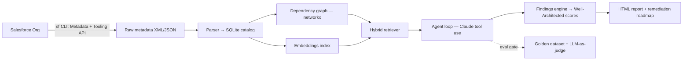

# Trowel — for Salesforce

**AI-powered Well-Architected assessments for Salesforce orgs.** Trowel excavates an org — mapping every Flow, Apex class, field, and permission — and produces the assessment a consultancy would charge $50k for.

*The Salesforce org archaeologist.*

Point it at any org. It tells you what the org *actually does*, where the tech debt is buried, which automations fight each other, and what to fix first.

> Built by [Pakshal Shah](https://linkedin.com/in/pakshalshah30) — Technical Program Manager & 6x-certified Salesforce Architect — as a working answer to the question: *what does agentic AI look like inside a governed enterprise platform?*
>
> Internal codename: `archaeologist` (you'll see it in the Python module names — the dig-site metaphor runs all the way down).

## What it does

1. **Excavate** — pulls full org metadata via the Salesforce CLI (Metadata + Tooling APIs)
2. **Catalog** — parses everything into a queryable inventory + dependency graph
3. **Understand** — hybrid retrieval (graph traversal + embeddings) lets an LLM agent answer questions like *"what happens when a Lead converts?"*
4. **Assess** — scores the org against Salesforce Well-Architected pillars, flags dead automation, conflicting triggers/Flows, permission sprawl
5. **Report** — generates a prioritized, plain-English remediation roadmap with an HTML report

## Why this is hard (and interesting)

- Org metadata is **structured** — pure vector RAG misses exact references, so retrieval is hybrid: dependency-graph traversal for facts, embeddings for semantics
- Findings must be **trustworthy** — every analysis path is gated by a golden-dataset eval suite (LLM-as-judge + deterministic checks) before it ships
- The agent must **reason across artifacts** — a "dead field" is only dead if no Flow, Apex, report, or integration touches it

## Status

🚧 In progress — see [ROADMAP.md](ROADMAP.md) for the 8-week build plan and [docs/FRAMEWORK.md](docs/FRAMEWORK.md) for architecture decisions.

## Quick start

```bash
# Prereqs: Python 3.11+, Salesforce CLI (sf), a Dev Edition org, ANTHROPIC_API_KEY
pip install -r requirements.txt
cp .env.example .env          # add your API key
sf org login web -a dig-site  # authenticate your target org
python -m archaeologist.excavate --org dig-site   # pull metadata
python -m archaeologist.summarize --flow MyFlow   # phase 1: explain one Flow
```

## Architecture


